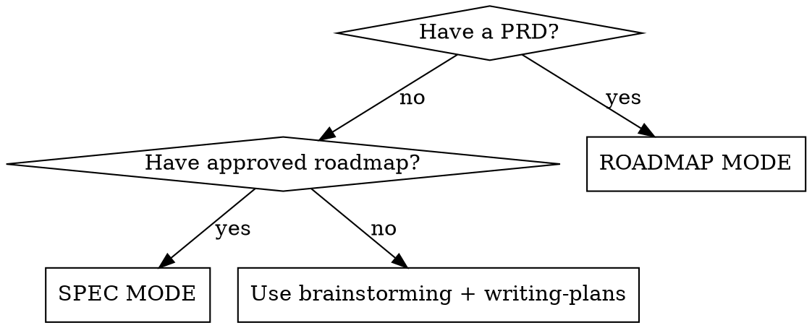

# Project Slicing

## Quick start

| Mode | Input | Output | When |
|------|-------|--------|------|
| ROADMAP | Full PRD | Phased roadmap | First time with the PRD |
| SPEC | Approved roadmap | Individual phase spec | One per phase |

1. **Have a PRD?** → ROADMAP MODE: read PRD → interview → generate phased roadmap
2. **Have an approved roadmap?** → SPEC MODE: read roadmap + codebase → generate one phase spec
3. **Have a phase spec?** → pass to `writing-plans` for implementation

Input: **TXT, Markdown, HTML** only. No PDF. Edge cases: see [REFERENCE.md](REFERENCE.md).



**Do NOT use when:**
- PRD has 1-2 features (use `brainstorming` + `writing-plans`)
- You already have a scoped single-subsystem spec
- PRD is in PDF format (convert to TXT/Markdown/HTML first)

---

## ROADMAP MODE

Paste this checklist into your response and update it as you complete each step:

```
ROADMAP Progress:
- [ ] Step 1: Read PRD + explore codebase
- [ ] Step 2: Refinement interview (one question at a time)
- [ ] Step 3: Generate roadmap (vertical slices, 3-5 stories/phase)
- [ ] Step 4: Save + get user approval
```

### 1. Read PRD + Explore Codebase

Read full PRD. If codebase exists, explore ONLY: root `ls` (one level), `package.json`, `glob: **/models/*, **/routes/*, **/api/*`. Greenfield? Skip.

### 2. Refinement Interview

**Use the `question` tool** to ask the user. This tool provides structured multiple-choice options and ensures clear, actionable responses.

Ask **exactly ONE question per message**, multiple choice when possible. Wait for answer before next. Only about what the PRD does not clarify:

- **Priorities:** must-have vs nice-to-have?
- **Scope:** "Billing — MVP-critical or post-launch?"
- **Ambiguities:** "Real-time — WebSocket, SSE, or polling?"
- **Technical risks:** "X technology — familiar or prefer alternative?"

**NEVER skip.** Every PRD has assumptions. NEVER make priority decisions without user. Features ONLY deferred if user confirms. **DO NOT batch.** ONE question, wait for answer, then next.

If user provides priority input (e.g., "CTO says X in Phase 1"), verify it doesn't break technical dependencies. If it does, report the conflict and ask the user to confirm or adjust. You still don't decide — you just surface the dependency issue.

### 3. Generate Roadmap

**Criteria:** Vertical slices (DB+API+UI) ordered by business value, respecting dependencies.

**Story count — hard limit, no exceptions:**
- **Stories = individual PRD user stories, NOT themes or groups.** Each story must be listed by its PRD number (e.g., "S1, S2, S3, S4, S5" NOT "Auth & Onboarding (S1-S9)").
- **Max 5 PRD stories per phase.** If >5: subdivide the phase, even if they share a domain.
- **Phases with 1-2 stories are allowed if:** (1) the domain is coherent (passes one-sentence test), (2) it's a vertical slice (DB+API+UI), and (3) merging with an adjacent phase would break domain coherence. Otherwise, merge with adjacent phase.
- Ranges like "1-9" count as 9 stories, not 1 entry. Do NOT use ranges to hide story count.
- "Setup infrastructure" or "testing" are NOT stories — they are cross-cutting concerns.
- If a theme contains >5 stories, split the theme into multiple phases.

**One domain per phase (one-sentence test):** Describe what the phase delivers WITHOUT using "and" or "+" more than once. ✅ "Meta Ads data integration with anomaly detection for ad metrics" (one domain). ❌ "AI Chat + Billing + Team Management" (three unrelated domains). ❌ "Polish + Billing + Launch" (grab bag of leftovers). If a phase needs "and"/"+" more than once, split it into separate phases.

**Phase 1 scope boundary:** Phase 1 delivers minimum viable user value — not the complete aha moment. Max 5 PRD stories. At most ONE external service integration. NO LLM/AI features in Phase 1 unless the product IS an AI product from day 1 AND even then, max 5 stories. NO notification delivery (email/Slack) in Phase 1 unless it IS the core value. Infrastructure setup is a cross-cutting concern, NOT a story. It is acceptable for the aha moment to span Phase 1 + Phase 2.

**Cross-cutting concerns are NEVER a phase:** Mobile responsive, accessibility (WCAG), security (RLS), monitoring, testing, error handling, and infrastructure setup apply to ALL phases. List them in a "Cross-Cutting Concerns" section in the roadmap. Do NOT create a phase for them.

Each phase must deliver something functional (no pure-backend or pure-UI phases). Core features before complementary.

**Roadmap content:** Executive summary, dependency graph, phase table (with columns: Phase, Name, Stories [individual PRD numbers], Dependencies, Value, Done Criteria, Status), deferred features, parallelizable phases, cross-cutting concerns. Tech stack listed as names only (e.g., "Next.js 14, Supabase, Stripe") — NO schema, NO table mappings, NO implementation details.

**Mandatory dependency analysis:** After generating phases, list every phase and its dependencies. For each pair of phases that share the same dependency but don't depend on each other, mark them as parallelizable. Add a note: "Even if executing sequentially (solo developer), these phases have NO technical dependency on each other."

**DO NOT:** generate phase specs yet, invent features, create horizontal phases, make priority calls without user, include database schema or table mappings in roadmap.

**Before presenting:** Run through the [Validation Checklist](REFERENCE.md#validation-checklist) (Roadmap section). Fix any failures before showing to user.

### 4. Save + Approval

Save to `docs/decomposition/roadmap/YYYY-MM-DD-<project>-roadmap.md`: executive summary, dependency graph, phase table (with status column — see [REFERENCE.md](REFERENCE.md) for lifecycle), deferred features, parallelizable phases.

**DO NOT proceed to SPEC MODE until user approves.**

---

## SPEC MODE

Paste this checklist into your response and update it as you complete each step:

```
SPEC Progress:
- [ ] Step 1: Context reading (strict scope)
- [ ] Step 2: Determine phase
- [ ] Step 3: Mini-interview
- [ ] Step 4: Generate phase spec
- [ ] Step 5: Save + handoff to writing-plans
```

### 1. Context Reading (STRICT)

Read in order: (1) roadmap, (2) previous phase specs, (3) codebase ONLY — root ls, `glob **/models/*, **/schemas/*, **/types/*, **/routes/*, **/api/*`, package.json. DO NOT read UI components, test files, or service implementations. Need something else? ASK first. **Violating reading rules wastes context and causes hallucinations.**

### 2. Determine Phase

User specifies → generate that phase. User says "next phase" → find first `pending` phase whose dependencies are all `completed`. Status lifecycle: pending → spec-generated → in-progress → completed (see [REFERENCE.md](REFERENCE.md)).

### 3. Mini-Interview

**Use the `question` tool** to ask the user. This tool provides structured multiple-choice options and ensures clear, actionable responses.

Ask: "Anything changed since last phase?" and "Roadmap says Phase N covers X and Y — still accurate?" These two can go in one message. Any additional questions (scope changes, cross-phase drift, ambiguities, feature clarifications) follow the same rule as ROADMAP MODE: **ONE question per message, wait for answer, then next.** A "follow-up" to a base question is still an additional question — it gets its own message. If a `brainstorming` spec exists for this phase, use as base.

**NEVER skip the mini-interview.** Even if the user says "generate directly", "I already confirmed everything", or "the scope is clear" — you MUST ask the two base questions and wait for explicit answers. User impatience does NOT override process integrity.

### 4. Generate Phase Spec

For each feature: **components** (name + one-line responsibility), **data models** (entities, fields, relationships — NO queries/logic), **API contracts** (method, path, request, response — NO implementation), **user flows**, **acceptance criteria**, **dependencies on previous phases**. Max 300 lines. Format and example: see [REFERENCE.md](REFERENCE.md).

**Scope boundary: Every component, data model, API contract, and acceptance criterion in this spec must trace to a PRD story explicitly listed in this phase's roadmap entry.** Before generating, list all PRD story numbers for this phase from the roadmap. For each element, ask: "Which story from THIS phase requires this?" If the answer is "a future phase needs this" or "it's good to have the schema ready" — REMOVE IT. writing-plans will add it when that phase is executed.

**Common leakage patterns to avoid:**
- Data models for features in later phases (ChatSession/ChatMessage in Phase 1 when Chat is Phase 4)
- API endpoints for features in later phases (notification-settings endpoint in Phase 1 when notifications are Phase 3)
- Nullable columns for future features (ad_spend, roas in DailyMetrics when only Shopify is Phase 1 — add them in the phase that needs them)
- Acceptance criteria referencing features from other phases

**FORBIDDEN in phase specs** (these belong in `writing-plans`):
- File paths or directory structures (`src/app/...`, `components/...`)
- SQL DDL (`CREATE TABLE`, types like `bigint`, `timestamptz`, constraints, indexes)
- Setup commands (`npm install`, `npx`, `pip install`, etc.)
- Environment variables (`NEXT_PUBLIC_*`, `SECRET_*`, `*_KEY`)
- Code of any kind (functions, queries, logic, conditionals)
- Framework-specific patterns (route groups, middleware config, file naming conventions)

**Allowed in code blocks:** ONLY JSON request/response shapes for API contracts.

DO NOT invent features. If ambiguous, ASK. If codebase contradicts roadmap, REPORT.

**Before presenting:** Run through the [Validation Checklist](REFERENCE.md#validation-checklist) (Spec section). Fix any failures before showing to user.

### 5. Save + Handoff

Save to `docs/decomposition/specs/YYYY-MM-DD-<project>-phase<N>-<topic>.md`. Update roadmap status to `spec-generated`. Suggest: invoke `writing-plans` with this spec.

---

## Cross-Phase Changes

Auto-detect codebase drift. Confirm in mini-interview. Detailed scenarios and handling: see [REFERENCE.md](REFERENCE.md#cross-phase-changes).

## Validation & Error Recovery

Before marking any output complete, run through the [Validation Checklist](REFERENCE.md#validation-checklist). For error scenarios and recovery: see [REFERENCE.md](REFERENCE.md#error-recovery).

## Critical Rules

- **ONE spec at a time**, just before execution. Never generate all phases at once.
- **Always interview.** Every PRD has assumptions. Never skip.
- **Every phase is a vertical slice.** No pure-backend or pure-UI phases. Every phase must pass the "can I verify this without the next phase?" test — if a phase's output is only consumed by a later phase (stored data, queued events, background computations) and no end user can see or interact with it directly, it is NOT a vertical slice. Merge it with its consuming phase.
- **DO NOT invent features** not in the PRD. DO NOT make priority calls without the user.
- **Specs define WHAT, not HOW.** No file paths, no SQL DDL, no code, no setup commands, no directory trees, no env vars. If it describes implementation rather than behavior, it belongs in `writing-plans`.

**Violating the letter of these rules is violating the spirit of these rules.**

**No exceptions — including these rationalizations:**
- "User instructions take precedence" — does NOT override one-spec-at-a-time, strict reading rules, or the interview requirement.
- "Domain-inherent" or "implementation requirement" — is NOT a valid reason to add features absent from the approved roadmap. If it's not on the roadmap, ASK first.
- "User already answered informally" — does NOT replace the formal mini-interview. Ask the questions explicitly.
- "Given the deadline" — does NOT justify generating specs with unconfirmed assumptions. Wait for confirmation.
- "Phase 1 is safe to produce" — does NOT replace formal roadmap approval. No spec generation until the roadmap is explicitly approved, even if a phase seems unaffected by pending changes.
- "Hybrid approach" — is NOT a valid reason to batch interview questions. ONE question per message, always.
- "Time constraint trade-off" — is NOT a valid reason to batch questions or skip process steps. Speed at the cost of process integrity produces worse outcomes.
- "This phase stores data the next phase displays" — is NOT a valid vertical slice. If no user can see or interact with a phase's output without the next phase, merge them.
- "Implementation context helps writing-plans" — does NOT justify including file paths, SQL, or code in specs. writing-plans generates implementation from abstract contracts.
- "User confirmed the scope" or "generate directly" — does NOT replace the formal mini-interview. Ask the questions explicitly and wait for answers.
- "Mapping tables in roadmap helps writing-plans" — does NOT justify including schema in roadmap. Roadmap lists tech stack names only. writing-plans reads PRD directly for schema.
- "Trimming spec content to fit 300 lines" — does NOT replace subdividing the phase. If spec exceeds 300 lines, the phase scope is too broad. Subdivide into two phases.
- "Phase 1 needs the full aha moment" — Phase 1 delivers minimum viable user value, not the complete product experience. If the aha moment requires 2 phases, that's correct. Do NOT stretch Phase 1 beyond 5 stories.
- "These domains go together because they're all post-core" — Post-core is not a domain. AI Chat, Billing, and Teams serve different user needs with different logic. One phase per domain.
- "Putting ChatSession in Phase 1 schema is pragmatic" — Pragmatism in the spec = feature leakage. Each spec only contains what that phase needs. writing-plans adds future features when their phase is executed.
- "The range 1-9 is more readable than listing individual numbers" — Ranges hide story count. "1-9" = 9 stories = exceeds the 5-story limit. List individually.
- "They're not parallelizable because I'm a solo developer" — Technical dependency ≠ implementation order. Marking phases as parallelizable is documentation accuracy, not a scheduling decision.
- "Testing/Polish/Launch is a valid phase" — Testing, accessibility, mobile responsive, monitoring, and infrastructure setup are cross-cutting concerns applied to every phase. They are NEVER a dedicated phase.

Full list of common mistakes and red flags: see [REFERENCE.md](REFERENCE.md).

---


